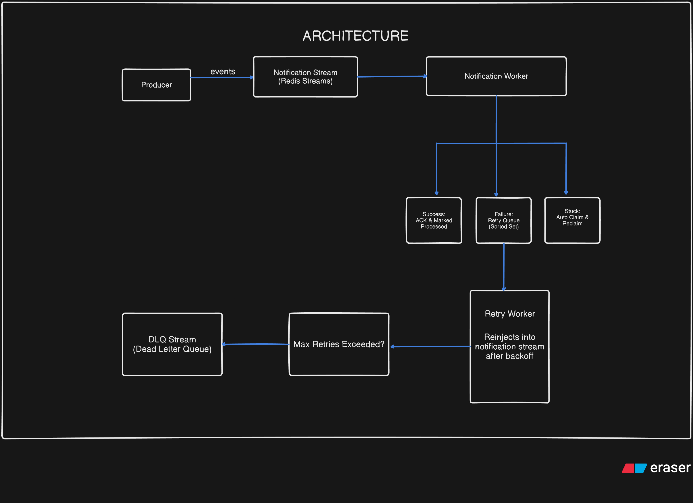
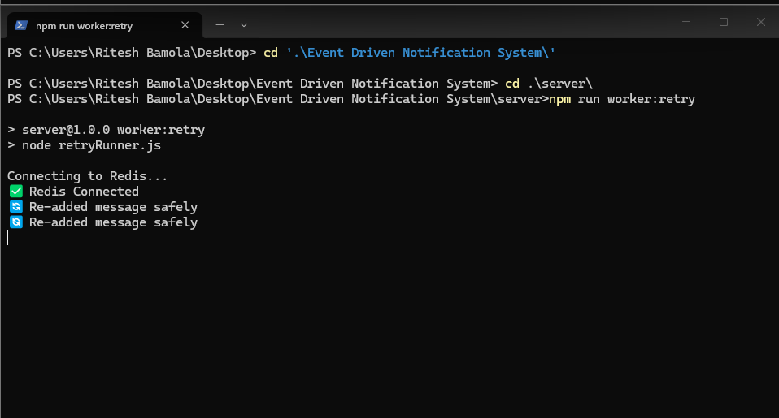

# Event Driven Notification System

A resilient, event-driven notification system built with **Node.js** and **Redis Streams**. The system reliably processes notification events with built-in retry logic, dead-letter queue (DLQ) support, message deduplication, and consumer group scaling.

---

## Table of Contents

- [Overview](#overview)
- [Architecture](#architecture)
- [Features](#features)
- [Prerequisites](#prerequisites)
- [Installation](#installation)
- [Configuration](#configuration)
- [Project Structure](#project-structure)
- [Components](#components)
- [Data Flow](#data-flow)
- [Running the System](#running-the-system)
- [Example: End-to-End Flow](#example-end-to-end-flow)
- [Retry Logic](#retry-logic)
- [Environment Variables](#environment-variables)
- [Extending the System](#extending-the-system)

---

## Overview

This system processes notification events (e.g., user registration, email notifications) using a message-streaming approach. Events are published to a Redis Stream, consumed by workers, and automatically retried on failure with exponential backoff. After a configurable number of retries, failed messages are moved to a Dead Letter Queue (DLQ) for manual inspection.

---

## Architecture



The diagram above shows the end-to-end flow: the **Producer** publishes events to the **Notification Stream** (Redis Streams). The **Notification Worker** consumes events and, based on the outcome, either acks and marks them processed, sends failures to the **Retry Queue (Sorted Set / ZSET)**, or reclaims stuck messages. The **Retry Worker** re-injects failed events back into the stream after the backoff delay. Events that exceed the max retry count are sent to the **DLQ Stream**.

### Key Redis Data Structures

| Structure | Type | Purpose |
|-----------|------|---------|
| `notifications-stream` | Stream | Main event stream; producers add, workers consume |
| `notifications-group` | Consumer Group | Enables multiple workers to share load |
| `notifications-retry-queue` | Sorted Set | Holds failed messages with `retryAt` timestamp as score |
| `notifications-dlq` | Stream | Dead Letter Queue for messages that exceed max retries |

---

## Features

- **Redis Streams** – Append-only logs with consumer groups for at-least-once delivery
- **Consumer Groups** – Scale notification workers horizontally
- **Exponential Backoff** – Retries with increasing delays (1s → 2s → 4s by default)
- **Dead Letter Queue (DLQ)** – Failed messages after max retries are preserved for debugging
- **Idempotency** – `processed:{eventId}` and `processing:{eventId}` keys prevent duplicate processing
- **Stuck Message Reclaim** – `XCLAIM` reclaims messages idle for 10+ seconds from crashed workers
- **Modular Runners** – Producer, notification worker, and retry worker can run as separate processes

---

## Prerequisites

- **Node.js** v18+ (for ES modules)
- **Redis** v6.2+ (with Streams support; typically v5.0+)

### Redis Installation

- **Windows**: [Redis for Windows](https://github.com/microsoftarchive/redis/releases) or use WSL/Docker
- **macOS**: `brew install redis`
- **Linux**: `sudo apt install redis-server` (Ubuntu/Debian)

---

## Installation

1. **Clone the repository**
   ```bash
   git clone <repository-url>
   cd "Event Driven Notification System"
   ```

2. **Install dependencies**
   ```bash
   cd server
   npm install
   ```

3. **Start Redis** (if not already running)
   ```bash
   redis-server
   ```

---

## Configuration

Configuration is centralized in `server/constants/streamConstants.js`:

| Constant | Default | Description |
|----------|---------|-------------|
| `STREAM_NAME` | `notifications-stream` | Main Redis Stream name |
| `GROUP_NAME` | `notifications-group` | Consumer group name |
| `RETRY_QUEUE` | `notifications-retry-queue` | Sorted set for retry scheduling |
| `DLQ_STREAM` | `notifications-dlq` | Dead Letter Queue stream |
| `MAX_RETRIES` | `3` | Maximum retry attempts before moving to DLQ |

Redis connection is configured in `server/config/redis.js` (default: `redis://localhost:6379`).

---

## Project Structure

```
Event Driven Notification System/
├── .gitignore
├── README.md
└── server/
    ├── config/
    │   └── redis.js           # Redis client setup
    ├── constants/
    │   └── streamConstants.js # Stream names, group, retry limits
    ├── producer/
    │   └── producer.js        # Event publishing logic
    ├── setup/
    │   └── initStream.js      # Consumer group creation
    ├── utils/
    │   ├── backoff.js         # Exponential backoff calculation
    │   └── logger.js          # (Reserved for logging)
    ├── workers/
    │   ├── notificationWorker.js  # Main consumer & processor
    │   └── retryWorker.js         # Re-injects messages from retry queue
    ├── index.js               # Main entry (all-in-one)
    ├── notificationRunner.js  # Notification worker only
    ├── producerRunner.js      # Producer only (one-shot)
    ├── retryRunner.js         # Retry worker only
    └── package.json
```

---

## Components

### 1. Producer (`producer/producer.js`)

Publishes events to the Redis Stream. Each event includes:

- `eventId` – UUID for idempotency
- `eventType` – e.g. `USER_REGISTERED`
- `email` – example payload field
- `retryCount` – current retry attempt (starts at 0)
- `createdAt` – timestamp

**Usage**: Run via `producerRunner.js` for one-shot publishing, or import `publishTestEvent` in your own code.

### 2. Notification Worker (`workers/notificationWorker.js`)

- Consumes messages from the stream using `XREADGROUP`
- Reclaims stuck messages via `XAUTOCLAIM` (idle > 10 seconds)
- Checks idempotency with `processed:{eventId}`
- Uses `processing:{eventId}` as a lock during handling
- On success: acks message, sets `processed` key
- On failure: schedules retry via retry queue or moves to DLQ after max retries

### 3. Retry Worker (`workers/retryWorker.js`)

- Polls the sorted set `notifications-retry-queue`
- Finds entries with `score ≤ now` (ready for retry)
- Re-adds them to the main stream via `XADD`
- Runs continuously in a loop

### 4. Stream Initialization (`setup/initStream.js`)

- Creates the consumer group on the stream with `XGROUP CREATE`
- Uses `MKSTREAM` so the stream is created if missing
- Handles `BUSYGROUP` when the group already exists

### 5. Backoff Utility (`utils/backoff.js`)

Calculates retry delay using exponential backoff:  
`delay = 2^retryCount * 1000` ms  
(e.g. 1s, 2s, 4s for retryCount 0, 1, 2)

---

## Data Flow

1. **Producer** publishes an event to `notifications-stream`.
2. **Notification Worker** reads with `XREADGROUP` (or processes reclaimed messages).
3. **Idempotency**: Skips if `processed:{eventId}` exists.
4. **Processing**: Acquires `processing:{eventId}` lock (NX, 24h TTL).
5. **Business logic** executes (currently simulated with random success/failure).
6. **Success**: Ack, set `processed`, release `processing` lock.
7. **Failure**: Add to retry queue with `retryAt = now + backoff`, then ack (removes from pending).
8. **Retry Worker** periodically moves ready messages from retry queue back to the stream.
9. After **MAX_RETRIES** failures, the message is added to `notifications-dlq` instead of the retry queue.

---

## Running the System

### Option 1: All-in-One (Single Process)

Runs producer, notification worker, retry worker, and stream init together:

```bash
cd server
npm start
```

Uses `nodemon` for auto-restart on file changes.

### Option 2: Separate Processes (Recommended for Production)

**Terminal 1 – Notification Worker**
```bash
cd server
npm run worker:notification
```

**Terminal 2 – Retry Worker**
```bash
cd server
npm run worker:retry
```

**Terminal 3 – Producer (one-shot)**
```bash
cd server
npm run producer
```

### NPM Scripts

| Script | Command | Description |
|--------|---------|-------------|
| `start` | `nodemon index.js` | All components in one process |
| `worker:notification` | `node notificationRunner.js` | Notification worker only |
| `worker:retry` | `node retryRunner.js` | Retry worker only |
| `producer` | `node producerRunner.js` | Publish one test event and exit |

---

## Example: End-to-End Flow

The following screenshots show a real run where events are published, one event fails and goes to the ZSET (retry queue), fails again with a 2-second backoff, and is eventually processed successfully.

### 1. Producer – Publishing Events


The producer connects to Redis and publishes test events. Each run produces a unique event ID (e.g. `1770890442812-0`, `1770890446176-0`). These events are appended to the `notifications-stream`.

### 2. Notification Worker – Processing, Failure, and Retry


The notification worker consumes events and processes them. In this run:

- **First failure:** Message `1770890448970-0` is picked up but processing fails (`❌ Processing failed`). The event is sent to the **Retry Queue (ZSET)** with `Retry scheduled in 1000ms`.
- **Second failure:** After about 1 second, the event returns (e.g. `1770890449974-0`) and fails again. The system schedules another retry: `Retry scheduled in 2000ms` (2 seconds).
- **Success:** After the 2-second backoff, the event is re-injected and processed successfully, then acknowledged.

This shows the **exponential backoff** (1s → 2s → 4s) and idempotency when the same logical event is retried.

### 3. Retry Worker – Re-injecting Failed Messages



The retry worker continuously polls the ZSET (`notifications-retry-queue`). When an event’s scheduled time has passed, it:

1. Retrieves it with `ZRANGEBYSCORE`
2. Removes it from the ZSET with `ZREM`
3. Re-adds it to the main stream with `XADD`

Each `🔄 Re-added message safely` line corresponds to a failed event being put back into the stream for the notification worker to process again.

---

## Retry Logic

- **First failure**: Retry in ~1 second
- **Second failure**: Retry in ~2 seconds  
- **Third failure**: Retry in ~4 seconds  
- **Fourth failure**: Moved to DLQ (no more retries)

Backoff formula: `2^retryCount * 1000` milliseconds.

---

## Environment Variables

For production, consider externalizing:

| Variable | Example | Description |
|----------|---------|-------------|
| `REDIS_URL` | `redis://localhost:6379` | Redis connection URL |
| `MAX_RETRIES` | `5` | Max retries before DLQ |
| `MIN_IDLE_TIME` | `10000` | Idle ms before reclaiming (notification worker) |

Update `config/redis.js` and `streamConstants.js` to read from `process.env` when needed.

---

## Extending the System

### Add New Event Types

Extend the producer payload and add handling in the notification worker:

```javascript
const event = {
  eventId: randomUUID(),
  eventType: "ORDER_SHIPPED",  // New type
  orderId: "12345",
  email: "user@example.com",
  retryCount: "0",
  createdAt: Date.now().toString(),
};
```

### Replace Simulated Logic

In `notificationWorker.js`, replace the random success/failure with real logic (e.g., calling an email API):

```javascript
// Replace: const success = Math.random() > 0.3;
const success = await sendEmail(data.email, data.eventType);
```

### Add More Workers

Use different `CONSUMER_NAME` values (e.g. `Worker-2`, `Worker-3`) when starting additional notification worker instances. Redis consumer groups will distribute messages across them.

### Inspect DLQ

```bash
redis-cli XRANGE notifications-dlq - +
```

---

## License

ISC
